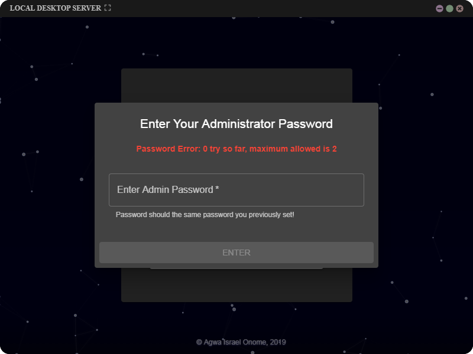
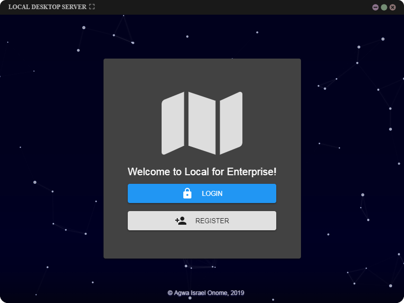
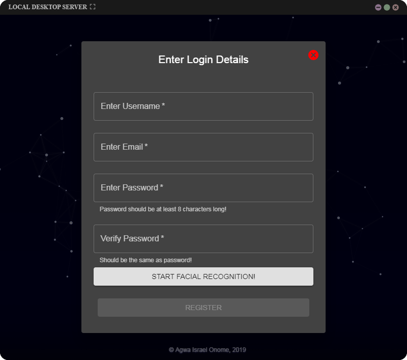
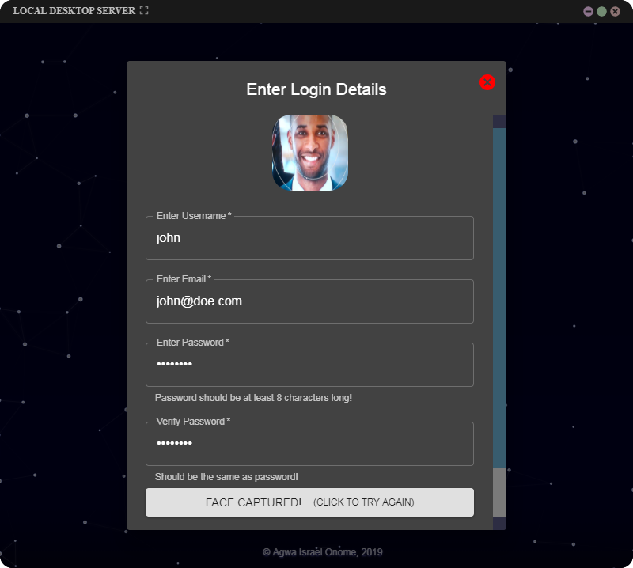
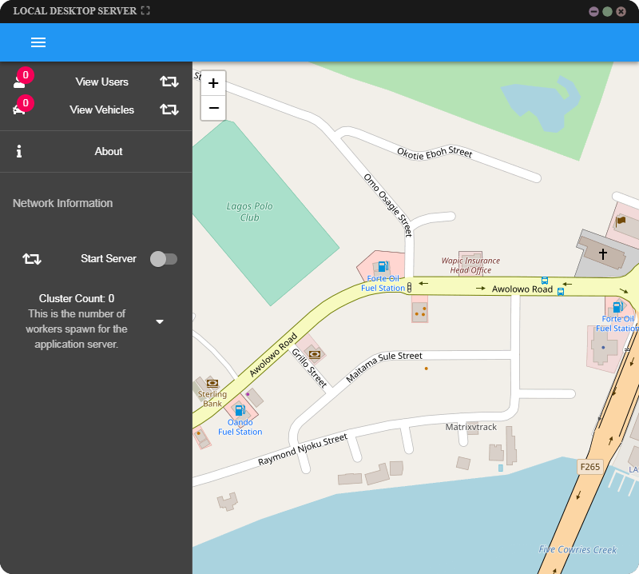

# local-desktop

> Work in progress. Not suitable for use in production.

This is a desktop server application for fleet management.  
**local-desktop** packages a mobile application which serves as clients for the server api.

### User Classes

There are 3 types of users:
+  ***Administrators*** These are the root users and there can be only 1 per application.
+  ***SuperUsers*** These are server application users. There can be many of such users per application.
    These users have access to live feed from client applications. Superusers manage the lient applications.
+  ***Clients*** These are end-users using the client application. They post live updates of their location to 'local-desktop'.

### Building

To build, you need to install dependencies. This application is written in typescript and requires a typescript compiler to build.  

Clone this repository and open terminal in the created folder. Run the following commands:

`npm i`
*(To install dependencies)*

`launch --build`
*or*
`launch -b`

The application will be built and open up after build is complete.

___
## Contributing

Send a pull request to contribute to development of local-desktop

>>> More to come...

---
<b style='font-size:0.9em'>&copy; Agwa Israel Onome 2019</b>  